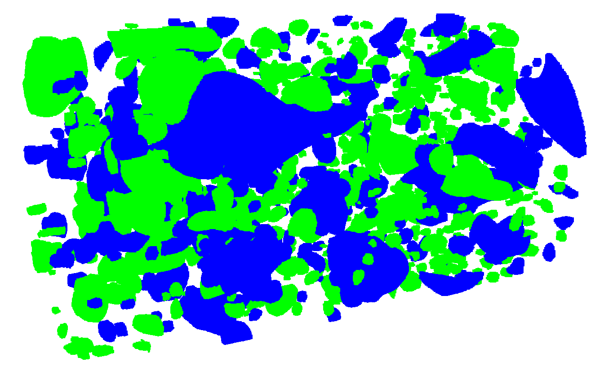
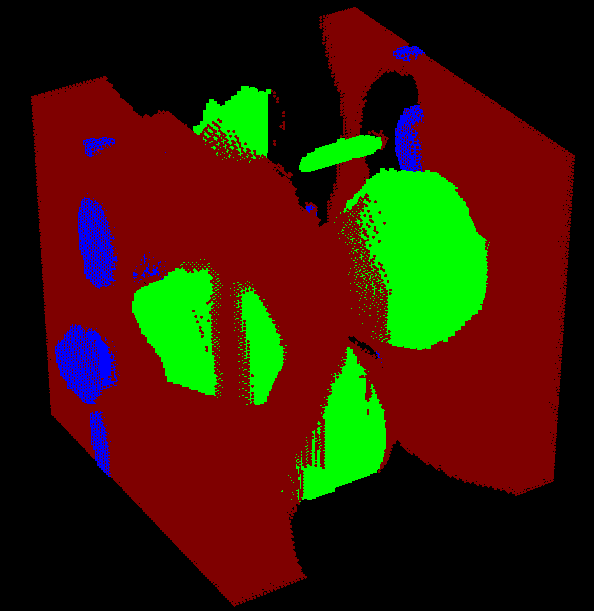

## Overview
This repository deals with mechanical simulations of Soil-Mixing materials and was done during my research internship at the [Centre for Mathematical Morphology (CMM)](https://www.cmm.minesparis.psl.eu/en/home/), in collaboration with [Université Gustave Eiffel](https://www.univ-gustave-eiffel.fr/). I generated a database of a few thousands of heterogeneous microstructures represented as point cloud 3D images and then predicted the elasticity threshold with supervised learning. The main result is that with the Mohr-Coulomb criterion the (highly non linear) elasticity threshold can be predicted with the elasticity matrix, and more substantially that the prediction is increased when more coefficients of the elasticity matrix are taken as features. A detailed, easy to understand report that explains the theoretical framework is available [here](report/internship_report.pdf).

Here is a short overview of what you can do with this repository: 
  * generate a dataset of 3D voxel microstructures and compute a mechanical response ([FileManager.py](FileManager.py), [generate_db_micro.py](generate_db_micro.py)).
  * 3D plot the microstructures, leveraging the GPU with [vispy](https://vispy.org/) ([plot_2_micro_lines.py](plot_2_micro_lines.py), [plot_2_shapes_microstructure.py](plot_2_shapes_microstructure.py))
  * predict the mechanical response with supervised learning ([linear regression](linear_regression.ipynb), [MLP](MLP_prototype.ipynb))

The mechanical response is computed with François Willot's morphhom Fortran code. You need morphhom to compute the mechanical response. Contact François Willot if you wish to make the mechanical computations. This code was produced during my internship, hence we extensively tested it on simple examples that have an analytic solution. Univ. Eiffel also provided a sample of the ground-truth material, so that we could compare the simulations with lab experiments.

I intend to add a tutorial to explain how to use the files.

## Examples of microstructures
Here are some examples of the microstructures I deal with:
 Ground-truth material (25.000.000+ voxels)

Microstructures with deformation surface in red (shows where the deformation is the highest), Mohr-Coulomb criteria.:

Deformation surfaces, Von Mises criteria:

